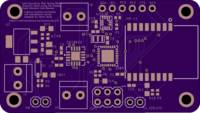
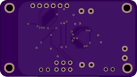

# pwmCat-motorBoard
Multidisciplinary Engineering class with requirements of remote-controlled vehicle design to complete "Cat's Conundrum Obstacle Course".
Spring 2018
Montana State University

EAGLE files for PCB for a motor board based on using the atmega328P microcontroller, DRV8833 motor driver, HM-11 Bluetooth LE module, and LSM6DS3TR accel/gyro.  
The atmega328P is used as a finite state machine for direction and speed control.  
The HM-11 receives a byte encoded with direction and speed from an iPhone user.
The atmega328P outputs Pulse-Width-Modulation(PWM) to the DRV8833, receives HM-11 byte via USART and receives accel/gyro data through I2C.
The board uses 3.3V for every device.  
There is a power kill-switch and jumper pin by the ISP1 to separate incoming 5V from other 3.3V devices when programming atmega328P. (TODO: alternative solution).
TODO: 47 uF capacitor as 0805 too small. Some other capacitors sizing needs tweaking.
